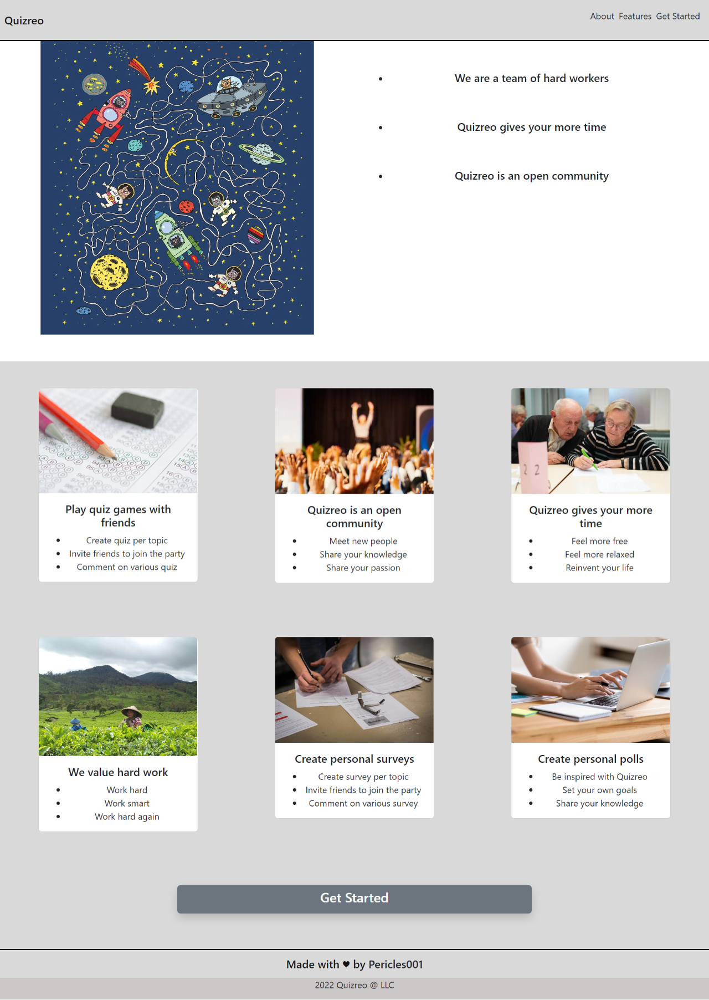

# Quizreo : Landing page

Quizreo is a web application that allows you to create quizzes and share them with your friends.

## Description

This specific project represents official landing page of Quizreo.
Its purpose is to serve you into informations about the project and its features.

## Technologies

* [Figma](https://www.figma.com/)
* [React](https://reactjs.org/)
* [react-socks](https://stackleap.io/js/react-socks)

## Demo

Demo is a screenshot of the web page to demonstrate overview of the topics

## Usage

You can get at the original application by clicking on __get started__ button

If you want to run this locally , follow these steps: 

* Clone the repository
* 
        git clone https://github.com/Pericles001/Quizreo_landing.git

* Navigate to the folder

        cd Quizreo_landing

  * Install dependencies

        npm install or yarn install

* Run the application
            
        npm run start or yarn start

## Contributing

If you want to contribute to this project, please follow these steps:

* Fork the repository
* Create a new branch
* Make the changes
* Commit the changes
* Push the changes to the repository
* Open a pull request
* Wait for a review
* Or if you find issues or any way to improve quality, open an issue

## Authors

* [Pericles001](github.com/Pericles001)
